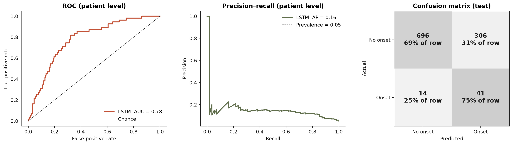
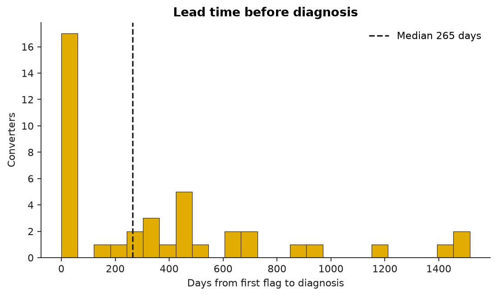
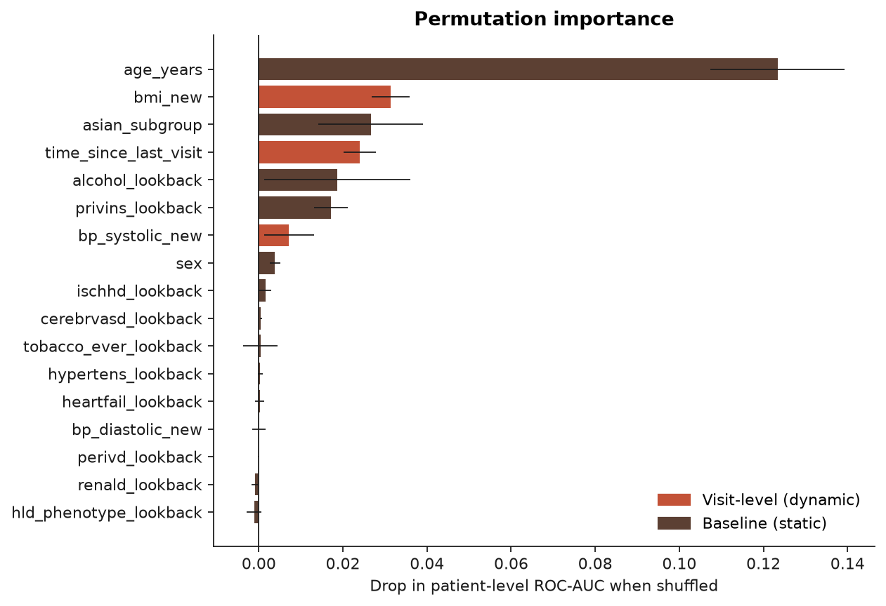

# Predicting Type 2 Diabetes Onset in Asian American Adults with an LSTM

A sequence model that reads routine office-visit vitals from electronic health records and flags patients at risk of developing type 2 diabetes, **months before the diagnosis is recorded**, with a focus on differences across Asian American ethnic subgroups.

**Veda Sripada** · NYU Langone Health, Center for the Study of Asian American Health

---

## Why this matters

Asian American adults develop type 2 diabetes at lower BMI than other groups, and risk varies widely between subgroups (for example, South Asian vs. East Asian). Standard BMI-based screening misses many of these patients. This project asks whether the vitals already collected at every routine visit (blood pressure, BMI, and how often a patient is seen) carry enough signal to identify future cases early.

## Results

> Results below are from the held-out test set of the real cohort (≈4,200 patients). Aggregate only; groups with fewer than 11 cases are suppressed.

| Metric (patient level, test set) | Value |
|---|---|
| ROC-AUC | **TBD** |
| PR-AUC (vs. prevalence baseline) | **TBD** |
| Sensitivity / Specificity | **TBD** |
| Median lead time before diagnosis | **TBD** days |

### Can routine vitals identify future cases?

<p align="center"></p>

**TBD:** what the ROC/PR curves show, and how PR-AUC compares with the prevalence baseline.

### How early?

<p align="center"></p>

**TBD:** median lead time, share of converters flagged before diagnosis, and subgroup differences.

### What drives the predictions?

<p align="center"></p>

**TBD:** the top features and how they line up with known risk factors.

## Approach

```
visit vitals (BP, BMI, time since last visit) ──► Masking ──► LSTM(64) ──┐
                                                                         ├─► Concatenate ──► Dropout ──► per-visit sigmoid
baseline covariates (age, sex, comorbidities, ──► Dense(32) ──► Repeat ──┘
insurance, Asian subgroup)
```

| Step | Detail |
|---|---|
| **Cohort** | Adults with office visits 2015–2019 and no diabetes in the lookback window |
| **Imputation** | Multilevel MICE (`2l.norm`, visits nested in patients) for BMI and BP. Outcome variables are excluded from the imputation model to prevent leakage |
| **Labels** | Positive at the first visit on or after the recorded diagnosis date. Post-diagnosis visits are dropped |
| **Splits** | Patient-level 60 / 15 / 25 train / validation / test, stratified on conversion. Scalers fit on training data only |
| **Imbalance** | Converters oversampled to 50% of non-converters; positive visits weighted 2× |
| **Threshold** | Youden's J chosen on the **validation** set, then applied unchanged to test |
| **Lead time** | Days from the first visit whose risk crosses the threshold to the recorded diagnosis |
| **Explainability** | Permutation importance measured as the drop in patient-level ROC-AUC (5 repeats) |

## Repository layout

```
├── r/01_data_prep.Rmd                   cohort definition, EDA, multilevel imputation
├── notebooks/diabetes_onset_lstm.ipynb  sequences, model, evaluation, lead time, importance
├── figures/                             plots used in this README
└── results/metrics.json                 aggregate test-set metrics
```

The underlying EHR data is protected health information and is not included. Every figure and number in this repository is aggregate.

## Limitations

- **Single health system.** External validation is needed before claiming generalisability.
- **Vitals only.** No labs (A1c, glucose), by design, to test what routine vitals alone can do.
- **Diagnosis date is a documentation proxy**, not true biological onset.
- **Single imputation.** Pooling across all 5 MICE datasets would propagate imputation uncertainty.
- **Small subgroups.** Some Asian subgroups have few converters, so their estimates are imprecise.

## Tech

Python · TensorFlow/Keras · scikit-learn · pandas · R · `mice` · tidyverse
