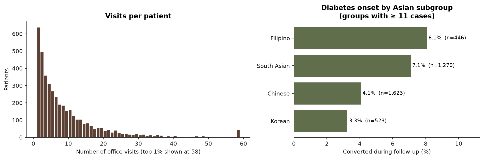
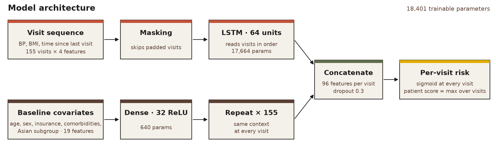
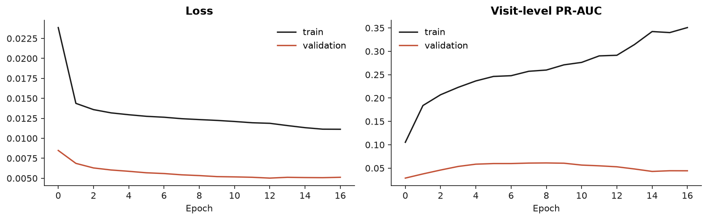

<h1 align="center">Predicting Type 2 Diabetes Onset<br>in Asian American Adults with an LSTM</h1>

<p align="center">
A recurrent neural network that reads routine office-visit vitals from electronic health records<br>
and flags patients at risk of type 2 diabetes <b>months before the diagnosis is recorded</b>.
</p>

<p align="center">
<b>Veda Sripada</b> · NYU Langone Health, Center for the Study of Asian American Health
</p>

<p align="center">


</p>

<table align="center">
<tr>
<td align="center"><h2>0.78</h2>patient-level<br>ROC-AUC</td>
<td align="center"><h2>3×</h2>precision over<br>chance (PR-AUC)</td>
<td align="center"><h2>98%</h2>negative<br>predictive value</td>
<td align="center"><h2>265 days</h2>median lead time<br>before diagnosis</td>
</tr>
</table>

---

## Contents

[Background](#background) · [Data](#data) · [The model](#the-model) · [Training](#training) · [Results](#results) · [Limitations](#limitations) · [Repository](#repository)

## Background

Asian American adults develop type 2 diabetes at **lower BMI** than other groups, and risk differs sharply between Asian ethnic subgroups. Screening rules built on BMI cutoffs miss many of these patients, and most studies treat "Asian" as one category.

This project asks two questions:

1. **Who?** Can the vitals already collected at every routine visit (blood pressure, BMI, and how often a patient is seen) identify who will develop diabetes, **without any lab values**?
2. **How early?** For patients who do convert, how long before the recorded diagnosis does the model first raise a flag?

## Data

Longitudinal EHR records from a large NYC academic health system:

- **4,225 adults** with **39,678 office visits** (2015–2019) and no diabetes in the lookback window.
- **218 (5.2%)** developed type 2 diabetes during follow-up.
- The onset rate **more than doubles** between subgroups, from 3.3% (Korean) to 8.1% (Filipino).

<p align="center"></p>

Missing BMI and blood pressure values were filled with **multilevel multiple imputation** (`mice`, `2l.norm`), which models visits nested within patients so each patient's own history informs their imputed values. The outcome was deliberately **excluded from the imputation model** so that diabetes status cannot leak into the features.

> The underlying data is protected health information and is not included in this repository. Every figure and number here is aggregate, and any group with fewer than 11 cases is suppressed.

## The model

<p align="center"></p>

### Why an LSTM?

Patients are seen at irregular intervals and for very different lengths of time: some have a single visit, others more than 50. A standard classifier needs a fixed-length summary such as "average BMI", which throws away the **trajectory**: a BMI that has crept up over three years is a different signal from one that has always been high.

A **Long Short-Term Memory (LSTM)** network is a recurrent neural network built for sequences. It reads a patient's visits one at a time, in order, and carries a learned memory forward. At each step, gates decide what to keep from earlier visits, what to update with the new measurements, and what to pass on. That lets it pick up slow drifts in BMI or blood pressure, and gaps between visits, that a single snapshot would miss.

### How it works

The network has two branches that are merged at every visit:

| Branch | Input | Layers | Role |
|---|---|---|---|
| **Visit sequence** | Up to 155 visits × 4 features: systolic BP, diastolic BP, BMI, log days since last visit | `Masking` → `LSTM(64)` | Learns how each patient's vitals evolve over time |
| **Baseline covariates** | 19 features: age, sex, insurance, 9 comorbidity flags, one-hot Asian subgroup | `Dense(32, ReLU)` → `RepeatVector` | Encodes fixed context and repeats it at every visit |
| **Head** | Both branches concatenated (96 features per visit) | `Dropout(0.3)` → `TimeDistributed(Dense(1, sigmoid))` | Outputs a risk score **at every visit** |

A few design choices make it work on real EHR data:

- **Masking.** Shorter sequences are padded to 155 steps with a sentinel value. The `Masking` layer makes the LSTM skip those steps entirely, so padding never looks like a real visit.
- **Per-visit output.** `return_sequences=True` gives a prediction after every visit, not just the last one. That is what makes **lead time** measurable: we can see the first visit at which risk crossed the threshold.
- **Patient-level score.** A patient's overall risk is the **maximum** of their visit-level scores.
- **Small by design.** 18,401 trainable parameters in total (17,664 in the LSTM), which suits a dataset with only a few hundred positive patients.

## Training

| | |
|---|---|
| **Labels** | Each visit is labelled 1 if diabetes was first recorded at that visit, otherwise 0. Visits after diagnosis are dropped so the model never sees post-diagnosis data |
| **Splits** | Patient-level 60 / 15 / 25 train / validation / test, stratified on conversion. No patient appears in more than one split |
| **Scaling** | Standardisation statistics are computed on the training set only |
| **Class imbalance** | Only ~0.6% of visits are positive. Converters are oversampled to 50% of non-converters, and positive visits get a 2× loss weight |
| **Optimisation** | Adam (lr 1e-3), binary cross-entropy, batch size 64 |
| **Early stopping** | Monitors validation PR-AUC (patience 8) and restores the best weights |
| **Threshold** | Youden's J on the **validation** set, then applied unchanged to the test set |

## Results

All results are from a held-out test set of **1,057 patients (55 converters)** that the model never saw during training or threshold selection.

| Metric (patient level, test set) | Value |
|---|---|
| ROC-AUC | **0.78** |
| PR-AUC | **0.16**, 3× the 0.05 prevalence baseline |
| Sensitivity / Specificity | **75% / 70%** |
| Negative predictive value | **98%** |
| Converters flagged before their diagnosis visit | **26 of 55 (47%)** |
| Median lead time (flagged converters) | **265 days** (IQR 0–493) |

### Can routine vitals identify future cases?

<p align="center"></p>

Using only blood pressure, BMI, visit timing and baseline covariates, the model ranks a future converter above a non-converter **78% of the time**. Because only 1 in 20 patients converts, precision–recall is the stricter test. Average precision is 0.16, **three times** what random ranking achieves.

At the validation-chosen threshold the model catches **3 in 4 future cases** while clearing 70% of patients who stay diabetes-free. The **98% negative predictive value** makes it most useful as a rule-out tool: a low score is strong reassurance, while a high score marks someone for follow-up testing such as an A1c.

### How early?

<p align="center"></p>

Of the 55 test-set converters, 41 were flagged at some point. **26 were flagged at an earlier visit than the one where diabetes was recorded**, some up to about 4 years ahead. Across all 41 flagged converters the median lead time is **265 days (about 9 months)**. The other 15 were flagged only at the diagnosis visit itself (the spike at 0), which suggests their vitals changed late or they had few prior visits.

Subgroup lead-time comparisons are not reported. Only one subgroup had at least 11 flagged converters in the test set, which is too few to compare reliably.

### What drives the predictions?

<p align="center"></p>

Permutation importance shuffles one input at a time across test patients and measures the drop in ROC-AUC. **Age** matters most (−0.12 AUC), followed by **BMI trajectory**, **Asian subgroup** and **time between visits**. These match known risk factors. Subgroup carrying independent signal supports the case for **disaggregating Asian American data** rather than treating it as one group. Visit frequency may reflect how closely a patient's clinicians are already monitoring them. Blood pressure and most baseline comorbidity flags added little once age and BMI were known.

<details>
<summary><b>Training curves</b></summary>
<br>
<p align="center"></p>
</details>

## Limitations

- **Single health system.** External validation is needed before claiming generalisability.
- **Vitals only.** No labs (A1c, glucose), by design, to test what routine vitals alone can do.
- **Diagnosis date is a documentation proxy**, not true biological onset, so lead time is measured against when diabetes was recorded.
- **Single imputation.** Pooling across all 5 MICE datasets would propagate imputation uncertainty.
- **Small subgroups.** Some Asian subgroups have few converters, so their estimates are imprecise.

## Repository

```
├── r/01_data_prep.Rmd                   cohort definition, EDA, multilevel imputation (R)
├── notebooks/diabetes_onset_lstm.ipynb  sequences, model, evaluation, lead time, importance (Python)
├── figures/                             all plots shown above
└── results/metrics.json                 aggregate test-set metrics
```
